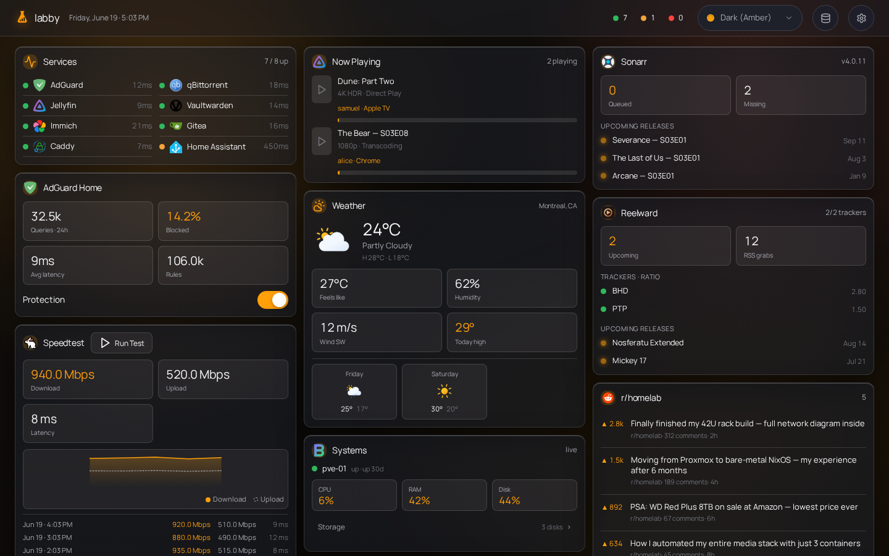

<p align="center">
  
</p>

<h1 align="center">Labby</h1>

<p align="center">
  <a href="LICENSE"></a>
  <a href="https://github.com/samuelloranger/labby/releases"></a>
  <a href="https://github.com/samuelloranger/labby/actions/workflows/docker.yml"></a>
  <a href="https://github.com/samuelloranger/labby/pkgs/container/labby"></a>
</p>



A self-hosted homelab dashboard — lightweight like [Glance](https://github.com/glanceapp/glance), interactive like [Homarr](https://github.com/homarr-labs/homarr). One Bun process, one container, config stored in a small SQLite database and editable in-app.

## Features

- **Widgets** — service monitor, Docker, qBittorrent/Transmission, SABnzbd, AdGuard, Jellyfin, Emby, Plex, Beszel, Radarr, Sonarr, Rawkoon, weather, calendar, speedtest, bookmarks, Reddit, Hacker News
- **Live updates** — server polls integrations and pushes changes over SSE (no client-side polling)
- **Interactive** — start/stop containers, pause/resume torrents, toggle AdGuard protection
- **Config & credentials** — stored in SQLite (`config/labby.db`), Zod-validated; edit service URLs/keys from the in-app Manage Services page
- **Theming** — named color schemes saved to the DB; no flash on first paint

## Security

**Labby has no authentication.** Run it behind a reverse proxy restricted to your LAN or VPN. Anyone who can reach the app can read status and control integrated services.

Do not expose Labby to the public internet without network-level access control.

## Quick start

Labby runs as a single container. Copy [`docker-compose.yml`](docker-compose.yml) and start it:

```bash
docker compose up -d
```

```yaml
services:
  labby:
    image: ghcr.io/samuelloranger/labby:latest
    restart: unless-stopped
    ports:
      - "8080:8080"
    volumes:
      - ./config:/app/config
```

Open `http://localhost:8080`, then add your service URLs and credentials on the **Manage Services** page (the Database icon in the header). On first run Labby seeds its SQLite DB (`config/labby.db`) with a default layout via built-in migrations; everything you configure is stored there, in the mounted `config/` volume.

> **`config/` must be writable by the user the container runs as.** If the DB errors with `SQLITE_READONLY`, set `user: "<uid>:<gid>"` in `docker-compose.yml` to match the owner of `config/`. Labby has no auth — keep it behind a LAN/VPN reverse proxy (see [Security](#security)).

## Build from source

Requires [Bun](https://bun.sh) (`curl -fsSL https://bun.sh/install | bash`).

```bash
bun install && (cd src/web && bun install)
bun run build
bun run start
```

## Configuration

User config lives in the SQLite database. Invalid config shows an error state instead of crashing the server.

Service credentials and per-instance settings (monitor sites, weather location, Docker hosts, download client URLs, etc.) are stored in the **`integrations`** table. Dashboard widgets reference an integration by `integrationId` and only carry display options (title, layout style, max items). Poll cadence is set per integration row (`refreshSeconds`), not in the dashboard JSON.

Configure everything from the **Manage Services** page — no `.env` file or flat env-var keys.

### Built-in integrations

Labby ships with a growing collection of integrations for the apps and services that usually live in a homelab:

<div align="center">
<table>
<tbody>
<tr>
<td align="center">
<a href="#built-in-integrations">
  
  <br/>
  <p align="center">Monitor</p>
</a>
</td>
<td align="center">
<a href="#built-in-integrations">
  
  <br/>
  <p align="center">Docker</p>
</a>
</td>
<td align="center">
<a href="#built-in-integrations">
  
  <br/>
  <p align="center">qBittorrent</p>
</a>
</td>
<td align="center">
<a href="#built-in-integrations">
  
  <br/>
  <p align="center">Transmission</p>
</a>
</td>
<td align="center">
<a href="#built-in-integrations">
  
  <br/>
  <p align="center">SABnzbd</p>
</a>
</td>
<td align="center">
<a href="#built-in-integrations">
  
  <br/>
  <p align="center">AdGuard<br/>Home</p>
</a>
</td>
</tr>
<tr>
<td align="center">
<a href="#built-in-integrations">
  
  <br/>
  <p align="center">Jellyfin</p>
</a>
</td>
<td align="center">
<a href="#built-in-integrations">
  
  <br/>
  <p align="center">Emby</p>
</a>
</td>
<td align="center">
<a href="#built-in-integrations">
  
  <br/>
  <p align="center">Plex</p>
</a>
</td>
<td align="center">
<a href="#built-in-integrations">
  
  <br/>
  <p align="center">Beszel</p>
</a>
</td>
<td align="center">
<a href="#built-in-integrations">
  
  <br/>
  <p align="center">Radarr</p>
</a>
</td>
<td align="center">
<a href="#built-in-integrations">
  
  <br/>
  <p align="center">Sonarr</p>
</a>
</td>
</tr>
<tr>
<td align="center">
<a href="#built-in-integrations">
  
  <br/>
  <p align="center">Rawkoon</p>
</a>
</td>
<td align="center">
<a href="#built-in-integrations">
  
  <br/>
  <p align="center">Weather</p>
</a>
</td>
<td align="center">
<a href="#built-in-integrations">
  
  <br/>
  <p align="center">Calendar</p>
</a>
</td>
<td align="center">
<a href="#built-in-integrations">
  
  <br/>
  <p align="center">Speedtest<br/>Tracker</p>
</a>
</td>
<td align="center">
<a href="#built-in-integrations">
  
  <br/>
  <p align="center">Bookmarks</p>
</a>
</td>
<td align="center">
<a href="#built-in-integrations">
  
  <br/>
  <p align="center">Reddit</p>
</a>
</td>
</tr>
<tr>
<td align="center">
<a href="#built-in-integrations">
  
  <br/>
  <p align="center">Hacker<br/>News</p>
</a>
</td>
</tr>
</tbody>
</table>
</div>

Most integrations ask for a base URL and either an API key, token, or username/password. Monitor and bookmarks rows accept lists of sites/links with optional per-item icons; Weather accepts an OpenWeather key plus city or coordinates; Hacker News has no required config.

You can add multiple integrations of the same type (e.g. two Radarr instances) — each gets its own row, poll interval, and SSE channel (`int:<id>`).

#### Docker host

The **Read host** / **Write host** fields accept either:

- A **TCP endpoint** — `tcp://host:2375` or `http://host:2375`. Docker does **not** expose this by default; point it at a [docker-socket-proxy](https://github.com/Tecnativa/docker-socket-proxy) (recommended — lets you allow reads but deny writes) or at a daemon with the TCP API enabled.
- A **unix socket** — `/var/run/docker.sock` or `unix:///var/run/docker.sock`, mounted into the Labby container. No proxy needed; point both **Read host** and **Write host** at the socket.

> **The socket grants full, root-equivalent control of the Docker daemon** ([docs](https://docs.docker.com/engine/security/protect-access/)). A `:ro` bind mount only makes the socket *file* read-only on the host — it does **not** restrict the Docker API, so anything that can reach the socket can still start/stop/delete containers. It is **not** a read-only connection. If you want true read/write separation (allow status, deny control), use the [docker-socket-proxy](https://github.com/Tecnativa/docker-socket-proxy) TCP option above instead and point **Write host** at a proxy that denies POST. The container must also be able to reach the socket — run Labby as a uid in the `docker` group, or matching the socket's owner.

### Icons

The `icon` field accepts prefixed strings:

| Prefix     | Example                                                           |
| ---------- | ----------------------------------------------------------------- |
| `di:`      | `di:jellyfin` — dashboard-icons (vendored at build, CDN fallback) |
| `sh:`      | `sh:immich` — selfh.st                                            |
| `lucide:`  | `lucide:film` — built-in line icon                                |
| URL / path | `https://…` or `/icons/custom.svg`                                |

### Refresh intervals

Set poll cadence per integration on the Manage Services page (`refreshSeconds`; defaults come from the integration type). The browser receives updates via SSE, not its own timers.

## Development

```bash
bun run dev              # API on :8080 (watch mode)
cd src/web && bun run dev    # Vite dev server, proxies /api → :8080
bun test
```

For frontend work, run **both** dev servers. `bun run dev` alone does not serve the SPA until you `bun run build`.

## Stack

- **Runtime** — Bun, TypeScript (strict)
- **Backend** — Hono (JSON API, static SPA, SSE)
- **Frontend** — Svelte 5, Vite
- **Config** — SQLite (`bun:sqlite`), Zod validation, automatically seeded via migrations

## License

MIT
