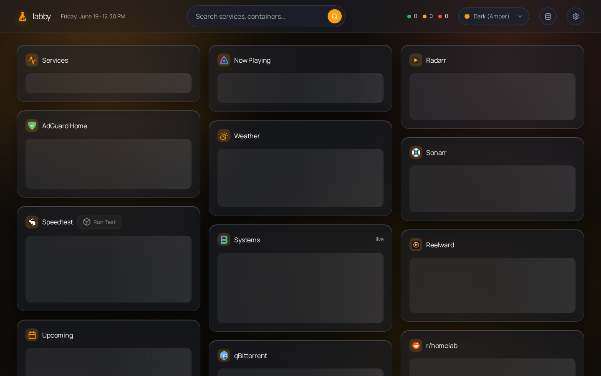

# Labby



A self-hosted homelab dashboard — lightweight like [Glance](https://github.com/glanceapp/glance), interactive like [Homarr](https://github.com/homarr-labs/homarr). One Bun process, one container, config stored in a small SQLite database and editable in-app.

## Features

- **Widgets** — service monitor, Docker, qBittorrent/Transmission, AdGuard, Jellyfin, Beszel, Radarr, Sonarr, Reelward, weather, calendar, speedtest, Reddit, Hacker News
- **Live updates** — server polls integrations and pushes changes over SSE (no client-side polling)
- **Interactive** — start/stop containers, pause/resume torrents, toggle AdGuard protection
- **Config & credentials** — stored in SQLite (`config/labby.db`), automatically seeded with a default layout on first run, Zod-validated; edit service URLs/keys from the in-app Manage Services page
- **Theming** — named color schemes saved to the DB; no flash on first paint

## Security

**Labby has no authentication.** Run it behind a reverse proxy restricted to your LAN or VPN. Anyone who can reach the app can read status and control integrated services.

Do not expose Labby to the public internet without network-level access control.

## Quick start

```bash
bun install && (cd src/web && bun install)
bun run build
bun run start
```

Open `http://localhost:8080`, then add your service URLs and credentials on the **Manage Services** page (the Database icon in the header). Everything is stored in the SQLite DB.

### Docker

```bash
docker compose up -d --build
```

On first run Labby automatically seeds its SQLite DB (`config/labby.db`) with a default layout and example integrations via built-in migrations. Configure your homelab services on the **Manage Services** page (the Database icon in the header). The DB lives in the mounted `config/` volume, so it must be writable **by the user the container runs as** — set `user: "<uid>:<gid>"` in `docker-compose.yml` to match the owner of `config/`, or writes fail with `SQLITE_READONLY`. Adjust `docker-compose.yml` networks to match your setup.

## Configuration

User config lives in the SQLite database. Invalid config shows an error state instead of crashing the server.

Service credentials and per-instance settings (monitor sites, weather location, Docker hosts, download client URLs, etc.) are stored in the **`integrations`** table. Dashboard widgets reference an integration by `integrationId` and only carry display options (title, layout style, max items). Poll cadence is set per integration row (`refreshSeconds`), not in the dashboard JSON.

Configure everything from the **Manage Services** page — no `.env` file or flat env-var keys.

### Built-in integrations

| Type | What to configure |
| --- | --- |
| `monitor` | HTTP sites to check (title, URL, icon per site) |
| `docker` | Read/write Docker hosts, container filter (`running` / `all`) |
| `qbittorrent` | URL, username, password |
| `transmission` | URL, username, password |
| `adguard` | URL, username, password |
| `jellyfin` | URL, API key |
| `beszel` | URL, username, password, token |
| `radarr` | URL, API key |
| `sonarr` | URL, API key |
| `reelward` | URL, API key |
| `weather` | OpenWeather API key, city or lat/lon, units |
| `calendar` | ICS feed URLs (one per line) |
| `speedtest` | Speedtest Tracker URL, API token |
| `reddit` | Subreddits to merge into one feed |
| `hackernews` | No config (Algolia front page) |

You can add multiple integrations of the same type (e.g. two Radarr instances) — each gets its own row, poll interval, and SSE channel (`int:<id>`).

### Icons

The `icon` field accepts prefixed strings:

| Prefix     | Example                                                           |
| ---------- | ----------------------------------------------------------------- |
| `di:`      | `di:jellyfin` — dashboard-icons (vendored at build, CDN fallback) |
| `sh:`      | `sh:immich` — selfh.st                                            |
| `lucide:`  | `lucide:film` — built-in line icon                                |
| URL / path | `https://…` or `/icons/custom.svg`                                |

### Refresh intervals

Set poll cadence per integration on the Manage Services page (`refreshSeconds`; defaults come from the integration type). The browser receives updates via SSE, not its own timers.

## Development

```bash
bun run dev              # API on :8080 (watch mode)
cd src/web && bun run dev    # Vite dev server, proxies /api → :8080
bun test
```

For frontend work, run **both** dev servers. `bun run dev` alone does not serve the SPA until you `bun run build`.

## Stack

- **Runtime** — Bun, TypeScript (strict)
- **Backend** — Hono (JSON API, static SPA, SSE)
- **Frontend** — Svelte 5, Vite
- **Config** — SQLite (`bun:sqlite`), Zod validation, automatically seeded via migrations

## License

MIT
